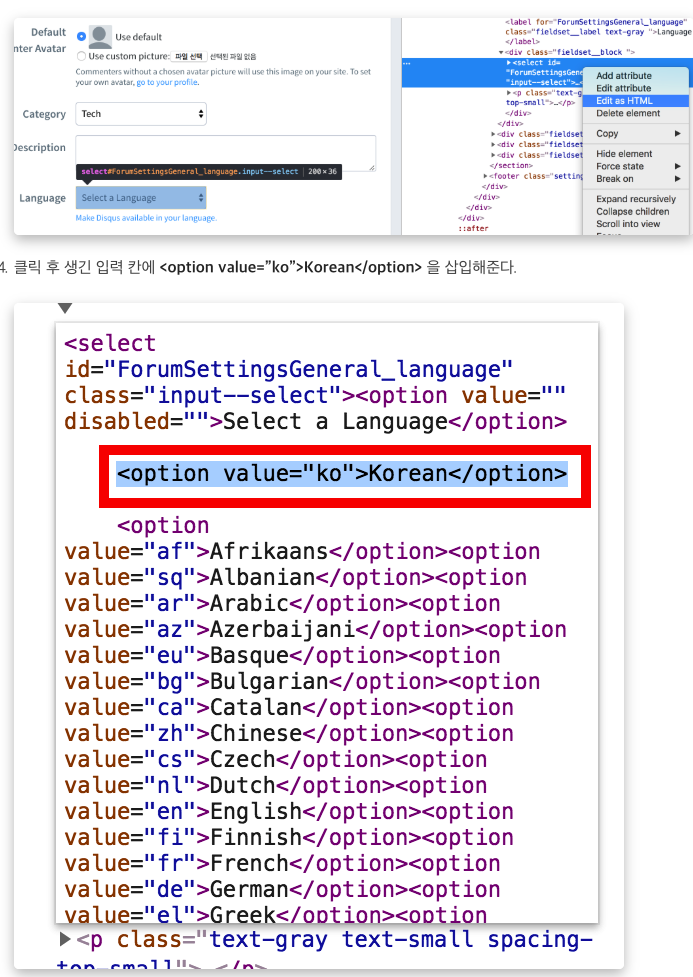

# 패키지 모음
## 태그 기능 오픈소스 패키지
`django-tagging 패키지 설치`

+ settings 안에 app 등록
	+ tagging.apps.TaggingConfig
+ models 안에 필드추가
	+ tag = TagField(), from fields import TagField
	+ TagField는 CharField 필드를 상속받아서 디폴트로 max_length=255, Blank=True로 정의하고 있어 컬럼 내용 없어도 됨.
+ views
	+ 템플릿 랜더링 처리만하는뷰`(template_name)`와 TOL(TaggedObjectList)는 ListView를 상속 받는뷰`(model, template_name)`(모델가 테그가 주어지면 태그가 달려있는 모델의 객체리스트를 보여줌)두개 나눠서 만들기

```
# 테이블 처리가 없이 단순히 템플릿 렌더링 처리만 하는뷰
class TagTV(TemplateView):
    template_name = 'tagging/tagging_cloud.html'
    

# TaggedObjectList 클래스는 ListView를 상속 받는 뷰, 모델과 태그가 주어지면 태그가 달려 있는 모델의 객체리스트를 보여줌
class PostTOL(TaggedObjectList):
    model = Post
    template_name = 'tagging/tagging_post_list.html'    
    
```

+ urls
	+ `path('tag/', TagTV.as_view(), name='tag_cloud')`
	+ `path('tag/<tag>/', PostTOL.as_view(), name='tagged_object_list')`

+ template

```
<div>
    <b>TAGS: </b>
# 패키지에 정의된 커스텀 태그를 사용하기 위해 모듈 로딩    
    
# tags_for_object 커스텀 태그를 사용해 object 객체에 달려 있는 태그들의 
리스트를 추출, object객체는 PostDV 클래스형 뷰에서 넘겨주는 컨텍스트 변수로서,
특정 Post 객체가 담겨 있음, 추출한 태그 리스트는 tags 템플릿 변수에 할당
        
    
    <a href="">{{ tag.name }}</a>
    
# for 루프 이후에 동일한 줄에 [TagCloud] 텍스트를 출력하고 URL 패턴을 링크로연결    
    <a href=""><i>[ TagCloud ]</i></a>
</div>
```

#### tagging_cloud.html

```


tagging_cloud.html





<div id="content">
    <h1>Blog Tag Cloud</h1>
# 태그 클라우드 영역 정의    
    <div class="tag-cloud">    
        
#  커스텀 태그를 사용해 태그 클라우드 표현방식 정의
1. blog.Post = 태그를 추출할 대상은 블로그 앱의 Post모델
2. as tags = 태그 리스트를 tags라는 템플릿 변수에 담는다
3. with steps=6 min_count=1 = 태그 폰트 크기 범위를 1~6, 출력용 최소 사용 횟수를 1로 정함
4. distribution=log = 태그 폰트 크기를 할당할때 수학 Logarithmic 알고리즘 사용        
        
        
# 각 태그별로 디자인을 적용하기 위해 스타일시트 클래스를 .tag-3 형식으로 지정       
        <span class="tag-{{ tag.font_size }}">
            <a href="">{{ tag.name }} ({{ tag.font_size }})</a>
        </span>
        
    </div>
</div>

```
#### tagging_post_list.html

```


tagging_post_list.html


<div id="content">
    <h1>Posts for tag - {{ tag.name }}</h1>
# object_list 객체는 PostTOL 클래스형 뷰에서 넘겨주는 컨텍스트 변수로서 특정 tag가
	달려있는 Post 리스트가 담겨있다    
    
        <h2><a href="{{ post.get_absolute_url }}">{{ post.title }}</a></h2>
        {{ post.modify_date|date:"N d, Y" }}
    <p>{{ post.description }}</p>
    
</div>

```


## 댓글 기능 패키지
`django-disqus 패키지 설치`

+ DISQUS 홈페이지에서 설정하기(www.disqus.com)
+ Shortname 찾는법
	+ 우측 상단의 설정 아이콘 -> admin -> 상단 메뉴settings -> 좌측메뉴 General

+ 원하는 채널 임의로 지정하기


+ settings에 등록할 shortname 보는곳


+ settings에 app추가(disqus, django.contrib.sites) -> `DISQUS_WEBSITE_SHORTNAME = 'shortname'` -> SITE_ID = 1 -> disqus 앱에는 테이블 정의가 없지만 django.contrib.sites앱에는 테이블이 있으므로 모델추가 명령어 필요함(makemigrations, migrate) -> templates 코딩
	+ django-disqus 패키지는 이 패키지를 사용하는 모든 사이트들을 구별할 수 있어야 하므로 django-disqus를 사용하는 장고의 각 사이트는 사이트 구별자를 갖고 있어야함, 이를 위해 장고의 기본 애플리케이션인 django.contrib.sites를 등록하고 SITE_ID값을 임의로 지정(`SITE_ID` 값 중복되면 안됨.)

+ templates 코딩

```
post_detail.html
 <div>
# disqus 앱에 정의된 커스텀 태그를 사용하기 위해 disqus_tags 모듈 로딩
        
# 커스텀 태그를 사용해 댓글 및 댓글 입력 폼과 DISQUS 아이콘 등을 출력         
        
 </div>
```

+ 한국어로 변경하기



## 라이브러리 패키지
`Pillow 패키지 설치`